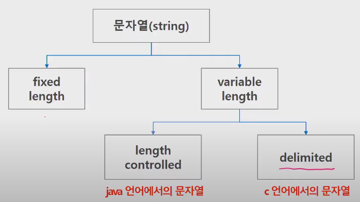

# 문자열

### 문자열

-  byte: 영문자를 한자를 나타내는 단위 ex) 100byte: 영문자 100글자

- 표준 ASCII는 7bit 인코딩, 확장 아스키는 8bit

-  big-endian vs. little-endian: 보통 pc는 little-endian, 일부 server는 big-endian / 앞으로 읽는게 낫나, 뒤부터 읽는게 낫나

- 유니코드(2byte)는 적당한 외부 인코딩이 필요 -> UTF-8(web, python), UTF-16(windows, java), UTF-32(unix)

- 문자열의 분류

  

- 파이썬은 char 타입 없음, 전부 string으로 처리
  - +(concatenation): 연결, *: 반복
  - 인덱싱, 슬라이싱 연산 사용 가능
  - replace(), split(), isalpha(), find() 등
  - immutable
- C는 아스키코드, java는 UTF-16, python은 UTF-8

- 문자열 뒤집기

  1. 자기 문자열에서 뒤집기 -> swap을 위한 임시 변수 필요, 문자열 길이 반만큼 반복 수행
  2. 빈 문자열에 쓰기

  In python, (1) string -> list 변환, (2) swap, (3) list -> string 변환

### 패턴 매칭

### 문자열 암호화

### 문자열 압축

### 실습 1, 2

