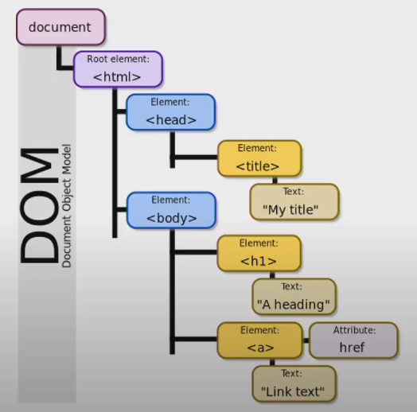

# 기초

## History

- Why JS? 브라우저 화면을 동적으로 만들기 위해 브라우저 조작!

- 계속되는 파편화를 방지하고 모든 브라우저에서 동일하게 동작하기 위한 표준의 필요성
- 크롬 등장 이후 여러 과정을 거쳐 JS의 고질적인 문제를 해결한 ES6 등장
- JS의 태생적 한계
  - 브라우저 안에서만 동작
  - BUT Node.JS(Runtime 환경) 이후 브라우저 밖에서도 동작 가능 -> Server Side 조작 가능
- jQuery
  - Cross Browsing Issue 해결 -> JS보다 jQuery 라이브러리 사용 좋아했었음
  - ES6 이후 순수 JS활용 증대

- Vanilla JS

  - 브라우저에 내장되어 있으므로 따로 설치 필요 없음
  - 빠름

- 브라우저에서 할 수 있는 일

  - DOM 조작

  - BOM 조작

  - JavaScript Core(ECMAScript)

    

## DOM(Documnet Object Model, 문서 객체 모델)

- 웹페이지 문서 구조를 표현함으로써 스크립트 및 프로그래밍 언어와 페이지를 연결

- 문서를 논리 트리로 표현, 각 노드는 객체를 가짐. 트리에 프로그래밍으로 접급

  

- 브라우저마다 각자의 방법으로 DOM을 구현

- 잘 구조화된 문서는 DOM을 사용해 트리구조를 얻어낼 수 있음(마크업의 중요성)

- Selection

  - 단일 Node

    ```
    document.getElementById(id)
    document.querySelector(selector)
    ```

    

  - HTMLCollection(live)

    ```
    document.getElementsByTagName(tagName)
    document.getElementsByClassName(class)
    ```

    

  - NodeList(non-live)

    ```
    document.querySelectorAll(selector)
    ```

    

  - querySelector(), querySelectorAll() 주로 사용

- Manipulation

  - innerText

    - 텍스트

  - innerHTML

    - XSS 공격에 취약점이 있으므로 사용시 주의

  - Node attribute

    - element.style.backgroudColor
    - setAttribute(attributeName, value)
    - getAttribute(attributeName)

  - Document.creatElement(tagName)

    - 특정 태그를 생성

  - ParentNode.appendChild(Node)

    - 마지막 자식 요소로 추가

  - ParentNode. removeChild(child Node)

    - 해당 요소를 제거

  - innerText vs. innerHTML

    -  전자는 진짜 텍스트 그대로 넣음. 후자는 해석하여 넣음

  - 정리

    1. 선택한다

       - querySelector()
       - querySelectorAll()
       - ...

    2. 변경한다

       - innerText

       - innerHTML

       - setAttrtibute()

       - getAttribute()

       - element.style.color

       - createElement()

       - appendChild()

       - ...

         

## Event(Listener)

click, submit, mouseover, keydown ...

=> **~하면 ~한다**

